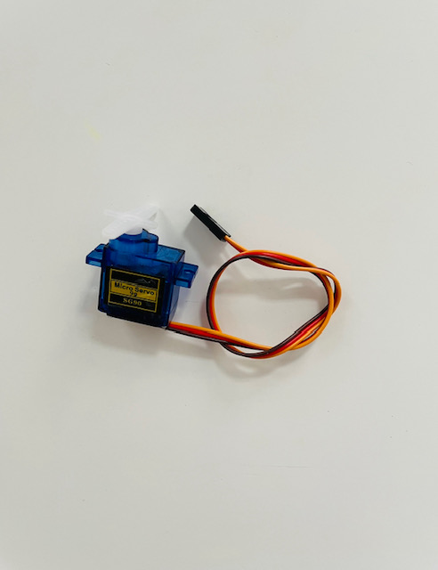
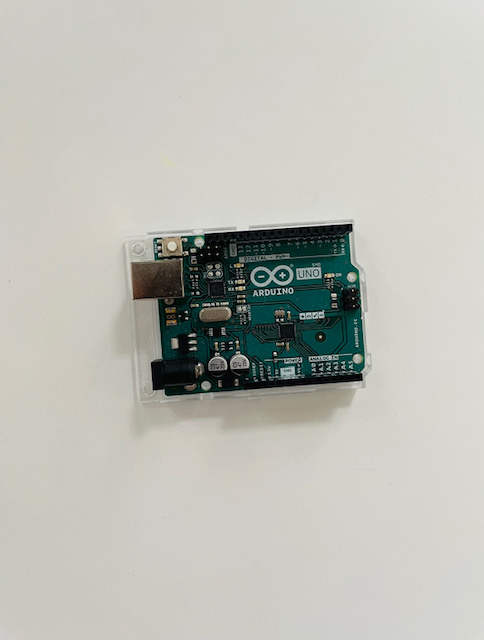
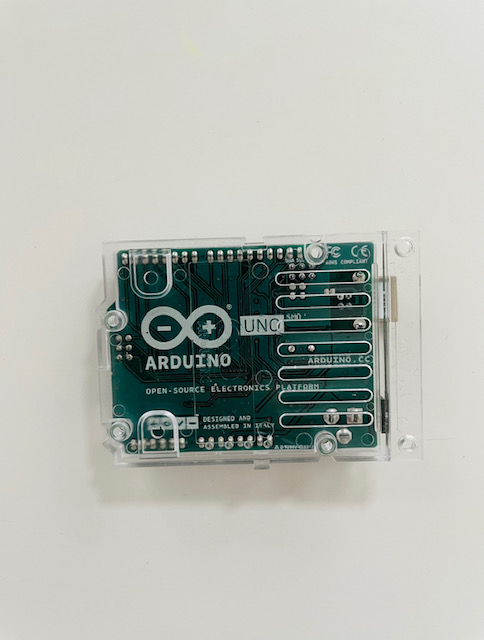
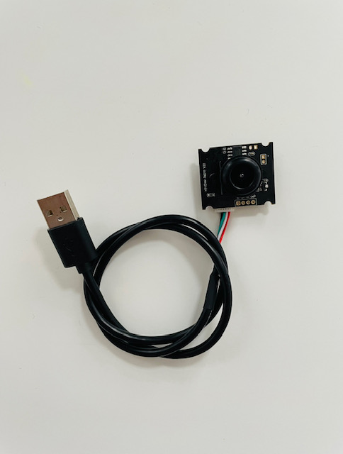
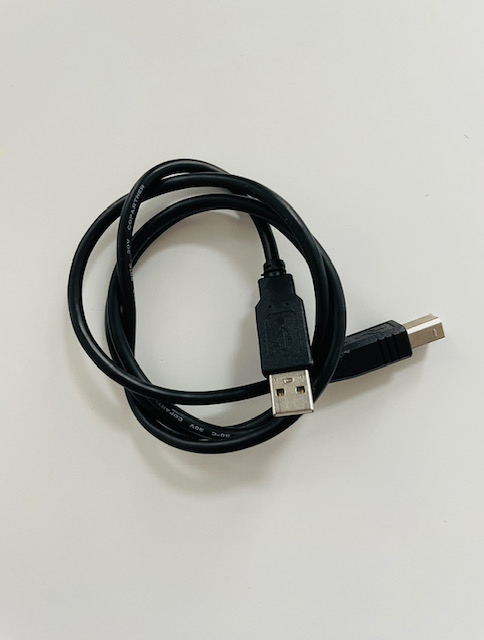
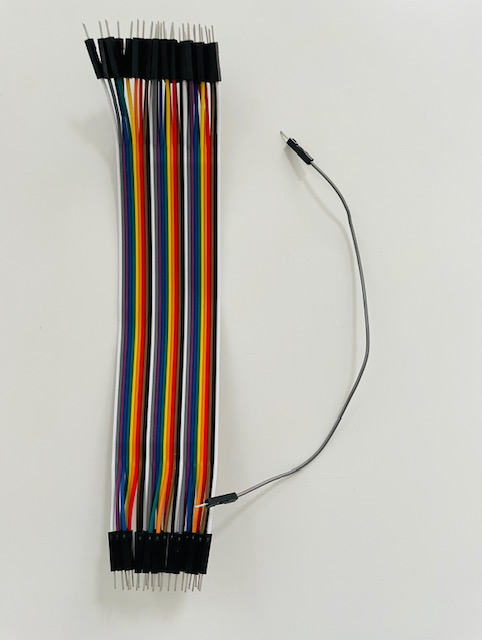
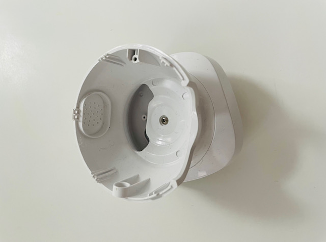
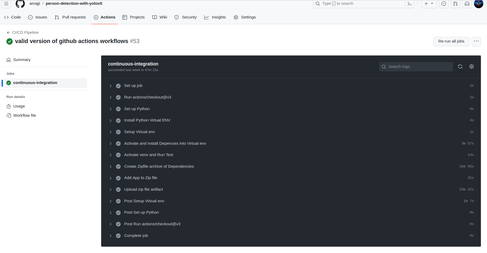

# Web scraping.
Data scientist | [Anass MAJJI](https://www.linkedin.com/in/anass-majji-729773157/)
***

## :monocle_face: Description
- In this project.  

 

## :rocket: Repository Structure
The repository contains the following files & directories:
- **Web_scrapping.ipynb:** This notebook contains all details about the webscraping steps using Scrapy framework.

## :chart_with_upwards_trend: Demontration

In this section, we are going to demonstrate a walkthrough on building and deployment of a Real-time Human Detection camera using Yolov5 model and Arduino UNO. We can split this project into two parts : 
	- Software part : Before deploying the model on the camera, we built a Fastapi webapp using HTML, CSS and JS. For the Client / Server connection we used the WebSocket protocol to send the real time yolov5's output as a streaming video.

- Hardware part : We deploy the yolov5 model using Arduino UNO card. For that, we need : 
- 2 Servo motors : used for vertical and horizontal rotation with a 120 rotation degree.

 

- Arduino UNO card : is a microcontroller board mainly used to interact and controll eletronic objects with an Arduino code.  

  
   

- 1080p USB Camera : with a 30 FPS (frame per second)
	

	 
	

- Connecting cables. 
	

	  
	   
	

- Camera shell
	

	   
	   
	

* To controll 2 servo-motors using arduino Card, we need first to  

- CI/CD : Finally, to deploy the project we use CI/CD which is one of the best practices in software development as it reduces the repetitive process of unit tests and the deployment of the software. For that, in src/test_app.py script, we test each function of the Fastapi webapp. All of these processes can be achieved using a new feature on github called github Actions. To create the CI/CD workflow, we need to create a .yml file on .github/workflows in which we have the intructions of our automated tests and deployment process.

 

## :chart_with_upwards_trend: Performance & results

---
## :mailbox_closed: Contact
For any information, feedback or questions, please [contact me][anass-email]

[anass-email]: mailto:anassmajji34@gmail.com
